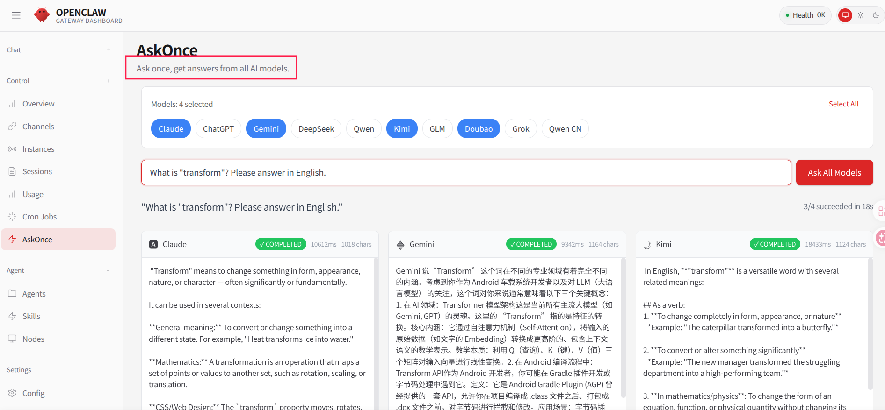

# OpenClaw Zero Token

**Zero API Token Cost** — Free access to AI models via browser-based authentication (ChatGPT, Claude, Gemini, DeepSeek, Qwen International & China, Doubao, Kimi, GLM, Grok, Manus, and more).

[](https://opensource.org/licenses/MIT)

[English](README.md) | [简体中文](README_zh-CN.md)

---

## Overview

OpenClaw Zero Token is a fork of [OpenClaw](https://github.com/openclaw/openclaw) with a core mission: **eliminate API token costs** by capturing session credentials through browser automation, enabling free access to major AI platforms.

### Why Zero Token?

| Traditional Approach | Zero Token Approach |
|---------------------|---------------------|
| Requires purchasing API tokens | **Completely free** |
| Pay per API call | No usage limits |
| Credit card binding required | Only web login needed |
| Potential token leakage | Credentials stored locally |

### Supported Platforms

| Platform | Status | Models |
|----------|--------|--------|
| DeepSeek | ✅ **Tested** | deepseek-chat, deepseek-reasoner |
| Qwen (International) | ✅ **Tested** | Qwen 3.5 Plus, Qwen 3.5 Turbo |
| Qwen (China) | ✅ **Tested** | Qwen 3.5 Plus, Qwen 3.5 Turbo |
| Kimi | ✅ **Tested** | Moonshot v1 8K, 32K, 128K |
| Claude Web | ✅ **Tested** | claude-sonnet-4-6, claude-opus-4-6, claude-haiku-4-6 |
| Doubao (豆包) | ✅ **Tested** | doubao-seed-2.0, doubao-pro |
| ChatGPT Web | ✅ **Tested** | GPT-4, GPT-4 Turbo |
| Gemini Web | ✅ **Tested** | Gemini Pro, Gemini Ultra |
| Grok Web | ✅ **Tested** | Grok 1, Grok 2 |
| GLM Web (智谱清言) | ✅ **Tested** | glm-4-Plus, glm-4-Think |
| GLM Web (International) | ✅ **Tested** | GLM-4 Plus, GLM-4 Think |
| Manus API | ✅ **Tested** | Manus 1.6, Manus 1.6 Lite (API key, free tier) |

> **Qwen International vs China:**
> - **Qwen International** (chat.qwen.ai) — For global users, no VPN required
> - **Qwen China** (qianwen.com) — For China users, faster speed, more features (deep search, code assistant, image generation, etc.)

> **Note:** All web-based providers use browser automation (Playwright) for authentication and API access. Platforms marked **Tested** have been verified to work.

### Tool Calling (Local Tools)

All supported models can call **local tools** (e.g. exec, read_file, list_dir, browser, apply_patch) so the agent can run commands, read/write files in the workspace, and automate the browser.

| Provider type | Tool support | Notes |
|---------------|--------------|--------|
| **Web (DeepSeek, Qwen, Kimi, Claude, Doubao, GLM, Grok)** | ✅ | XML-based tool instructions in system prompt; stream parser extracts `<tool_call>` and executes locally. |
| **ChatGPT Web / Gemini Web / Manus API** | ✅ | Same approach: tool instructions + multi-turn context + `<tool_call>` parsing (see [Tool Calling doc](docs/TOOL_CALLING_MODELS.md)). |
| **OpenRouter / OpenAI-compatible API** | ✅ | Native `tools` / `tool_calls` API. |
| **Ollama** | ✅ | Native `/api/chat` tools. |

The agent’s file access is limited to the configured **workspace** directory (see `agents.defaults.workspace` in config). For details and verification steps, see **[docs/TOOL_CALLING_MODELS.md](docs/TOOL_CALLING_MODELS.md)**.

### Additional Features

**Ask once, get answers from all AI models.** — AskOnce lets you query multiple configured AI models at once and compare their responses in a single view.



### Setup Steps (6 Steps)

```bash
# 1. Build
npm install && npm run build && pnpm ui:build

# 2. Open browser debug
./start-chrome-debug.sh

# 3. Login to platforms (Qwen, Kimi, Claude, etc. — exclude DeepSeek)
# 4. Configure onboard
./onboard.sh

# 5. Login DeepSeek (Chrome + onboard select deepseek-web)
# 6. Start server
./server.sh start
```

> **Important:** Only platforms completed in `./onboard.sh` are written into `openclaw.json` and shown in `/models`.

> **Platform support:**
> - **macOS / Linux:** Follow [START_HERE.md](START_HERE.md) for the step-by-step flow; see [INSTALLATION.md](INSTALLATION.md) for detailed setup. Run `./check-setup.sh` (on macOS you can also use `./check-mac-setup.sh`).
> - **Windows:** Use WSL2, then follow the Linux flow ([START_HERE.md](START_HERE.md), [INSTALLATION.md](INSTALLATION.md)). Install WSL2: `wsl --install`; guide: https://docs.microsoft.com/en-us/windows/wsl/install.

See **START_HERE.md**, **INSTALLATION.md**, and **TEST_STEPS.md** for details.

### Notes

- **Session validity**: Sessions may expire periodically; re-login when needed
- **Browser dependency**: Chrome must run in debug mode
- **Compliance**: For personal learning and research only; use official APIs for commercial use

---

## Quick Start

> **Platform support:**
>
> - 🍎 **macOS** / 🐧 **Linux**: Follow [START_HERE.md](START_HERE.md) for step-by-step flow; see [INSTALLATION.md](INSTALLATION.md) for detailed setup.
> - 🪟 **Windows**: Use WSL2, then follow the Linux flow ([START_HERE.md](START_HERE.md), [INSTALLATION.md](INSTALLATION.md)). Install WSL2: `wsl --install`; guide: https://docs.microsoft.com/en-us/windows/wsl/install

### Environment Requirements

- Node.js >= 22.12.0
- pnpm >= 9.0.0
- Chrome browser
- **OS**: macOS, Linux, or Windows (WSL2)

### Script Overview

The project provides several helper scripts for different scenarios:

```
┌─────────────────────────────────────────────────────────────────────┐
│                         Script Flow Diagram                          │
├─────────────────────────────────────────────────────────────────────┤
│                                                                      │
│  First-time setup:                                                   │
│  ┌──────────────────────────────────────────────────────────────┐  │
│  │ 1. Build              npm install && npm run build && pnpm ui:build │  │
│  │ 2. Open browser debug  ./start-chrome-debug.sh               │  │
│  │ 3. Login to platforms  Qwen, Kimi, Claude, etc.              │  │
│  │ 4. Configure onboard   ./onboard.sh                          │  │
│  │ 5. Start server        ./server.sh start                     │  │
│  └──────────────────────────────────────────────────────────────┘  │
│                                                                      │
│  Daily use:                                                          │
│  ┌──────────────────────────────────────────────────────────────┐  │
│  │ start-chrome-debug.sh → onboard.sh → server.sh start         │  │
│  │ server.sh [start|stop|restart|status]  Manage Gateway        │  │
│  └──────────────────────────────────────────────────────────────┘  │
│                                                                      │
└─────────────────────────────────────────────────────────────────────┘
```

**Core scripts (3):**

| Script | Purpose | When to use |
|--------|---------|-------------|
| `start-chrome-debug.sh` | Launch Chrome in debug mode | Step 2: Opens browser on port 9222 for platform login and onboard connection |
| `onboard.sh` | Auth configuration wizard | Steps 4–5: Select platform (deepseek-web, etc.), capture Cookie/Token |
| `server.sh` | Manage Gateway service | Step 6 and daily: `start` / `stop` / `restart` / `status`, port 3001 |

### Installation

```bash
# Clone repo
git clone https://github.com/linuxhsj/openclaw-zero-token.git
cd openclaw-zero-token

# Install dependencies
pnpm install
```

### Startup

#### Step 1: Build

```bash
pnpm build
pnpm ui:build   # Build Web UI (required for http://127.0.0.1:3001)
```

#### Step 2: Configure Auth

```bash
# Copy config (optional: onboard or server will copy from .openclaw-state.example if missing)
# First run: copy .openclaw-state.example/openclaw.json to .openclaw-zero-state/openclaw.json

# Run config wizard
./onboard.sh

# Or use built version
node openclaw.mjs onboard

# Select auth provider
? Auth provider: DeepSeek (Browser Login)

# Select login mode
? DeepSeek Auth Mode:
  > Automated Login (Recommended)  # Auto-capture credentials

# Once you see auth success, you're done. To add more models, run ./onboard.sh again.
```

#### Step 3: Start Gateway

```bash
# Use helper script (recommended)
./server.sh
```

---

## System Architecture

```
┌─────────────────────────────────────────────────────────────────────────────┐
│                              OpenClaw Zero Token                             │
├─────────────────────────────────────────────────────────────────────────────┤
│                                                                              │
│  ┌─────────────┐    ┌─────────────┐    ┌─────────────┐    ┌─────────────┐  │
│  │   Web UI    │    │  CLI/TUI    │    │   Gateway   │    │  Channels   │  │
│  │  (Lit 3.x)  │    │             │    │  (Port API) │    │ (Telegram…) │  │
│  └──────┬──────┘    └──────┬──────┘    └──────┬──────┘    └──────┬──────┘  │
│         │                  │                  │                  │          │
│         └──────────────────┴──────────────────┴──────────────────┘          │
│                                    │                                         │
│                           ┌────────▼────────┐                               │
│                           │   Agent Core    │                               │
│                           │  (PI-AI Engine) │                               │
│                           └────────┬────────┘                               │
│                                    │                                         │
│  ┌───────────────────────────────────────────────────────────────────────┐  │
│  │  Provider Layer                                                       │  │
│  │  DeepSeek Web (Zero Token)                                       ✅   │  │
│  │  Qwen Web Int'l/CN (Zero Token)                                  ✅   │  │
│  │  Kimi (Zero Token)                                               ✅   │  │
│  │  Claude Web (Zero Token)                                         ✅   │  │
│  │  Doubao (Zero Token)                                             ✅   │  │
│  │  ChatGPT Web (Zero Token)                                        ✅   │  │
│  │  Gemini Web (Zero Token)                                         ✅   │  │
│  │  Grok Web (Zero Token)                                           ✅   │  │
│  │  GLM Web (Zero Token)                                            ✅   │  │
│  │  Manus API (Token)                                               ✅   │  │
│  └───────────────────────────────────────────────────────────────────────┘  │
│                                                                              │
└─────────────────────────────────────────────────────────────────────────────┘
```

---

## How It Works

### Zero Token Authentication Flow

```
┌────────────────────────────────────────────────────────────────────────────┐
│                     DeepSeek Web Authentication Flow                        │
├────────────────────────────────────────────────────────────────────────────┤
│                                                                             │
│  1. Launch Browser                                                          │
│     ┌─────────────┐                                                        │
│     │ openclaw    │ ──start──▶ Chrome (CDP Port: 18892)                    │
│     │ gateway     │             with user data directory                   │
│     └─────────────┘                                                        │
│                                                                             │
│  2. User Login                                                              │
│     ┌─────────────┐                                                        │
│     │ User logs in│ ──visit──▶ https://chat.deepseek.com                   │
│     │  browser    │             scan QR / password login                    │
│     └─────────────┘                                                        │
│                                                                             │
│  3. Capture Credentials                                                     │
│     ┌─────────────┐                                                        │
│     │ Playwright  │ ──listen──▶ Network requests                           │
│     │ CDP Connect │              Intercept Authorization Header            │
│     └─────────────┘              Extract Cookies                            │
│                                                                             │
│  4. Store Credentials                                                       │
│     ┌─────────────┐                                                        │
│     │ auth.json   │ ◀──save── { cookie, bearer, userAgent }               │
│     └─────────────┘                                                        │
│                                                                             │
│  5. API Calls                                                               │
│     ┌─────────────┐     ┌─────────────┐     ┌─────────────┐               │
│     │ DeepSeek    │ ──▶ │ DeepSeek    │ ──▶ │ chat.deep-  │               │
│     │ WebClient   │     │ Web API     │     │ seek.com    │               │
│     └─────────────┘     └─────────────┘     └─────────────┘               │
│         Using stored Cookie + Bearer Token                                  │
│                                                                             │
└────────────────────────────────────────────────────────────────────────────┘
```

### Key Technical Components

| Component | Implementation |
|-----------|----------------|
| **Browser Automation** | Playwright CDP connection to Chrome |
| **Credential Capture** | Network request interception, Authorization Header extraction |
| **PoW Challenge** | WASM SHA3 computation for anti-bot bypass |
| **Streaming Response** | SSE parsing + custom tag parser |

---

## Roadmap

### Current Focus
- ✅ DeepSeek Web, Qwen International, Qwen CN, Kimi, Claude Web, Doubao, ChatGPT Web, Gemini Web, Grok Web, GLM Web, GLM International, Manus API — all **tested and working**
- 🔧 Improving credential capture reliability
- 📝 Documentation improvements

### Planned Features
- 🔜 Auto-refresh for expired sessions

---

## Adding New Platforms

To add support for a new platform, create the following files:

### 1. Authentication Module (`src/providers/{platform}-web-auth.ts`)

```typescript
export async function loginPlatformWeb(params: {
  onProgress: (msg: string) => void;
  openUrl: (url: string) => Promise<boolean>;
}): Promise<{ cookie: string; bearer: string; userAgent: string }> {
  // Browser automation login, capture credentials
}
```

### 2. API Client (`src/providers/{platform}-web-client.ts`)

```typescript
export class PlatformWebClient {
  constructor(options: { cookie: string; bearer?: string }) {}
  
  async chatCompletions(params: ChatParams): Promise<ReadableStream> {
    // Call platform Web API
  }
}
```

### 3. Stream Handler (`src/agents/{platform}-web-stream.ts`)

```typescript
export function createPlatformWebStreamFn(credentials: string): StreamFn {
  // Handle platform-specific response format
}
```

---

## File Structure

```
openclaw-zero-token/
├── src/
│   ├── providers/           # Web auth & API clients
│   │   ├── *-web-auth.ts    # Platform login & credential capture
│   │   └── *-web-client.ts  # Platform API client
│   ├── agents/              # Stream handlers
│   │   └── *-web-stream.ts  # Platform response parsing
│   ├── commands/            # Auth flows (auth-choice.apply.*.ts)
│   └── browser/             # Chrome automation (chrome.ts)
├── ui/                      # Web UI (Lit 3.x)
├── .openclaw-zero-state/    # Local state (not committed)
│   ├── openclaw.json        # Config
│   └── agents/main/agent/
│       └── auth.json        # Credentials (sensitive)
└── .gitignore               # Includes .openclaw-zero-state/
```

---

## Usage

### Web UI

After running `./server.sh`, the Web UI starts automatically. Use AI models directly in the chat interface. You can also open the chat directly at `http://127.0.0.1:3001/chat?session=<session-id>`.

#### Switching Models

Use the `/model` command in the chat interface to switch AI models:

```bash
/model claude-web
/model doubao-web
/model deepseek-web

# Or specify a concrete model
/model claude-web/claude-sonnet-4-6
/model doubao-web/doubao-seed-2.0
/model deepseek-web/deepseek-chat
```

#### List Available Models

Use `/models` to see all configured models:

```bash
/models
```

> **Rule:** Only platforms completed in `./onboard.sh` are written to `openclaw.json` and shown in `/models`.

This displays:

- All available providers (claude-web, doubao-web, deepseek-web, etc.)
- Model list under each provider
- Currently active model
- Model aliases and config info

**Example output:**

```
Model                                      Input      Ctx      Local Auth  Tags
doubao-web/doubao-seed-2.0                 text       63k      no    no    default,configured,alias:Doubao Browser
claude-web/claude-sonnet-4-6               text+image 195k     no    no    configured,alias:Claude Web
deepseek-web/deepseek-chat                 text       64k      no    no    configured
```

### API

```bash
curl http://127.0.0.1:3001/v1/chat/completions \
  -H "Authorization: Bearer YOUR_GATEWAY_TOKEN" \
  -H "Content-Type: application/json" \
  -d '{
    "model": "deepseek-web/deepseek-chat",
    "messages": [{"role": "user", "content": "Hello!"}]
  }'
```

### CLI

```bash
node openclaw.mjs tui
```

---

## Configuration

### openclaw.json

```json
{
  "auth": {
    "profiles": {
      "deepseek-web:default": {
        "provider": "deepseek-web",
        "mode": "api_key"
      }
    }
  },
  "models": {
    "providers": {
      "deepseek-web": {
        "baseUrl": "https://chat.deepseek.com",
        "api": "deepseek-web",
        "models": [
          {
            "id": "deepseek-chat",
            "name": "DeepSeek Chat",
            "contextWindow": 64000,
            "maxTokens": 4096
          },
          {
            "id": "deepseek-reasoner",
            "name": "DeepSeek Reasoner",
            "reasoning": true,
            "contextWindow": 64000,
            "maxTokens": 8192
          }
        ]
      }
    }
  },
  "gateway": {
    "port": 3001,
    "auth": {
      "mode": "token",
      "token": "your-gateway-token"
    }
  }
}
```

---

## Troubleshooting

### First Run: Use Config Wizard (Recommended)

```bash
./onboard.sh
```

The wizard creates all required files and directories.

### Fix Issues: Use Doctor Command

If the project has run before but you hit missing directories or files:

```bash
node dist/index.mjs doctor
```

The doctor command will:

- ✅ Check required directories
- ✅ Create missing directories
- ✅ Fix file permissions
- ✅ Validate config integrity
- ✅ Detect state directory conflicts
- ✅ Provide repair suggestions

**Limitations:**

- ❌ `doctor` does **not** create `openclaw.json`
- ❌ `doctor` does **not** create `auth-profiles.json`
- ✅ If config is missing or broken, run `./onboard.sh` again

**When to use:** Directory deleted, permission errors, environment check, session history lost. **Not for first run** — use `onboard.sh` instead.

---

## Security

1. **Credentials**: Cookies and Bearer tokens are stored locally in `auth.json` — **never commit to Git**
2. **Session expiry**: Web sessions may expire; re-login when needed
3. **Rate limits**: Web APIs may have rate limits; not suitable for high-frequency calls
4. **Compliance**: For personal learning and research only; follow platform ToS

---

## Upstream Sync

This project is based on [OpenClaw](https://github.com/openclaw/openclaw). To sync upstream:

```bash
git remote add upstream https://github.com/openclaw/openclaw.git
git fetch upstream
git merge upstream/main
```

---

## Contributing

Contributions are welcome, especially:

- Bug fixes
- Documentation improvements

---

## License

[MIT License](LICENSE)

---

## Acknowledgments

- [OpenClaw](https://github.com/openclaw/openclaw) — Original project
- [DeepSeek](https://deepseek.com) — Excellent AI models

---

## Disclaimer

This project is for learning and research only. When using it to access third-party services, ensure you comply with their terms of service. The developers are not responsible for any issues arising from use of this project.
